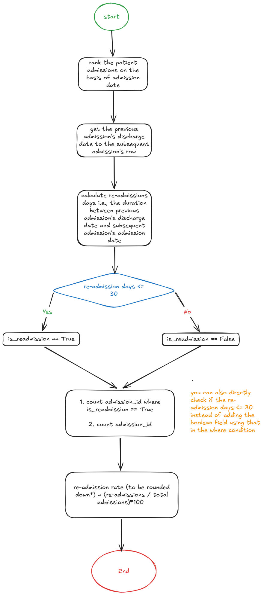

# 🏥 Hospital Readmission Analysis
### Maven Analytics Data Drill

This repository contains my solution to the **Readmission Radar Data Drill** by **Maven Analytics**, where the objective was to calculate a hospital's **30-day readmission rate** using patient admission records.

🔗 **Original Data Drill:** *[text](https://mavenanalytics.io/data-drills/readmission-radar)*

---

# 📋 Problem Statement

The dataset contains **623 in-patient admissions** from a small hospital.

Each record contains:

- Admission ID
- Patient ID
- Admission Date
- Discharge Date

The objective is to calculate the hospital's **30-day readmission rate**, where a readmission is defined as:

> A patient being admitted again within **30 days** of their previous discharge.

Day **30** is included in the readmission window.

---

# 🎯 Objective

Determine the percentage of admissions that qualify as 30-day readmissions.

---

# 🔄 Solution Workflow



The overall approach was:

1. Sort admissions chronologically for every patient.
2. Rank each admission within every patient's admission history.
3. Retrieve the previous discharge date using `groupby()` and `shift()`.
4. Calculate the number of days between the previous discharge and the current admission.
5. Identify admissions occurring within **30 days**.
6. Calculate the overall readmission rate.

---

# 🛠️ Technologies Used

- Python
- Pandas
- Google Colab

---

# 📚 Pandas Concepts Used

- Datetime manipulation
- `sort_values()`
- `groupby()`
- `rank()`
- `shift()`
- Boolean filtering

---

# 📈 Result

| Metric | Value |
|---------|------:|
| Total Admissions | 623 |
| 30-Day Readmissions | 232 |
| Readmission Rate | **37%** |

The final percentage was rounded **down** to the nearest whole number, as required by the challenge.

---

# 📂 Repository Structure

```
hospital-readmission-analysis/
│
├── README.md
├── readmission_analysis.ipynb
├── workflow.png
└── requirements.txt
```

---

# 📓 Notebook

The complete implementation, including exploratory analysis, code, and outputs, is available in:

- `readmission_analysis.ipynb`

---

# 💡 Key Learnings

During this project, I explored several useful pandas techniques, including:

- Solving sequential event problems using `groupby()` and `shift()`
- Replicating SQL-style window functions with `rank()`
- Working with datetime arithmetic
- Translating business rules into code
- Understanding the difference between an inclusive threshold (`<= 30`) and inclusive day counting

One interesting challenge was correctly interpreting the instruction **"Day 30 is included."** Initially, I added one day to the calculated interval, which incorrectly reduced the readmission rate. The correct implementation is to calculate the day difference normally and classify admissions where the interval is **less than or equal to 30 days**.


## 👩‍💻 Author

**Gayatri Sood**